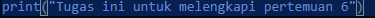
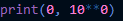
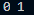
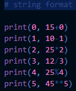
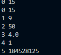
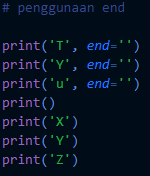
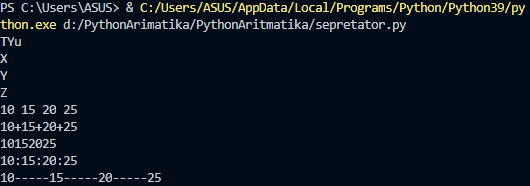

# Tugas ini untuk melengkapi pertemuan ke 6
# Dan menjelaskan project

**Nama :Risky HariAdi**  
**Nim  :312010124**  
**Kelas:TI.A1.20**  
**Tugas:Bahasa Pemrogramman**  

# Pengertian print  

`print`  
*print("Tugas ini untuk melengkapi pertemuan 6")  

  

* Menampilkan hasil print 

  

# Bitwise (,)  

* Bitwise adalah operator khusus untuk menangani operasi logika bilangan biner dalam bentuk bit.  

  

* Hasil Output  

# Aritmatika dalam bahasa pemograman  

* Aritmatika Terdiri dari 6 Oprator Dan Symbol berikut **PENJELASAN DI BAWAH INI**  
* `Penjumlahan (+)`  

* `Pengurangan (-)`  

* `Perkalian (*)`  

* `Pembagian (/)`  

* `Sisa Bagi (%)`  

* `Pemangkatan (**)`  

* `Dan sekkarang kita coba semua oprator/symbol ditas`  

  

* Setelah di run  

# KOLOM 2  
Penggunaan (END)  

* Jadi Penggunaan end adalah, Untuk menyatukan semua variabel seperti contoh  

* Setelah menjalankan  

# Penggunaan separtor  

**`w, d, y, z = 10, 15, 20, 25`**  

* `w 10`  
* `d 15`  
* `y 20`  
* `z 25`   

  