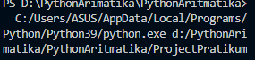

# Tugas ini untuk melengkapi pertemuan ke 6
# Dan menjelaskan project

**Nama :Risky HariAdi**  
**Nim  :312010124**  
**Kelas:TI.A1.20**  
**Tugas:Bahasa Pemrogramman**  

# Pengertian print  

`print`  
*print("Tugas ini untuk melengkapi pertemuan 6")  

  

* Menampilkan text di atas 

  